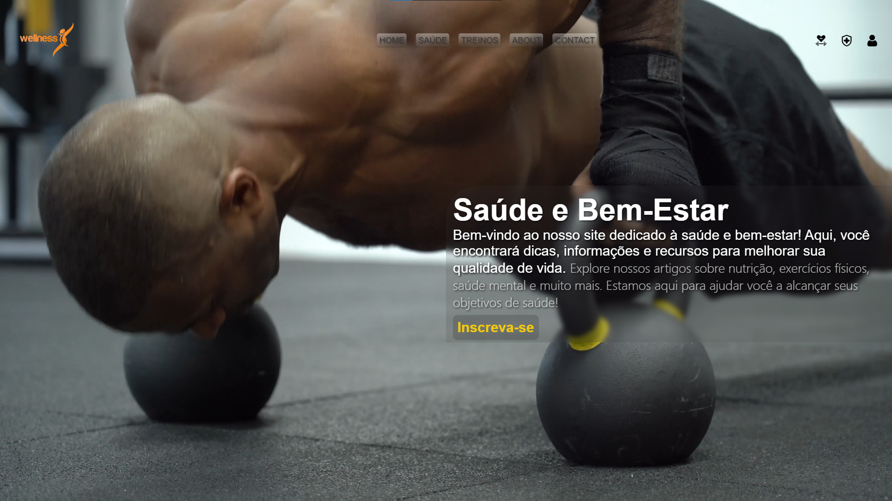

# 🌿 Saúde e Bem-Estar

Este projeto é um site simples e moderno voltado para o tema **Saúde e Bem-Estar**, desenvolvido com HTML5, CSS3 e um toque de design interativo com vídeo de fundo. Ele foi criado como parte do meu aprendizado no [DevClub](https://devclub.com.br), onde estou desenvolvendo habilidades práticas em desenvolvimento web.

---

## 🧠 O que aprendi com este projeto

Durante o desenvolvimento deste site, pratiquei os seguintes conceitos:

- ✅ Estruturação semântica com **HTML5**
- 🎨 Estilização moderna com **CSS3**
- 📺 Integração de **vídeo de fundo**
- 🧱 Layouts com **Flexbox**
- 🎯 Design com foco em **acessibilidade visual** (contraste, sombras, fontes)
- 🧪 Separação de código em **HTML + CSS**

---

## 🚀 Tecnologias Utilizadas

- HTML5
- CSS3
- Flexbox
- Responsividade básica
- Vídeo (MP4) em `<video autoplay loop>`

---

## 📸 Prévia do Projeto

> A interface contém um cabeçalho com logo e menu, texto introdutório sobre saúde e bem-estar e um vídeo de fundo suave e responsivo.

---

## 📁 Como Rodar o Projeto 

1. LInk para acessar o repositório: 
<a href='https://isaquep-06.github.io/Aulas-DevClub/'>https://isaquep-06.github.io/Aulas-DevClub/ </a> 
